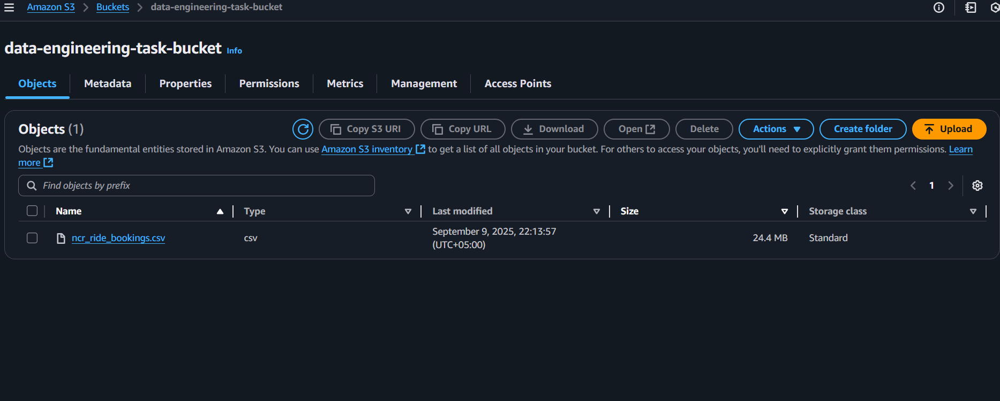
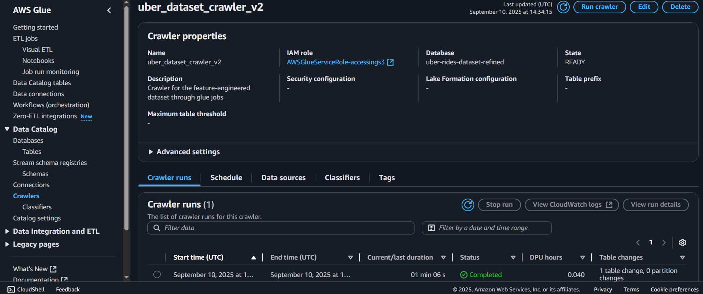
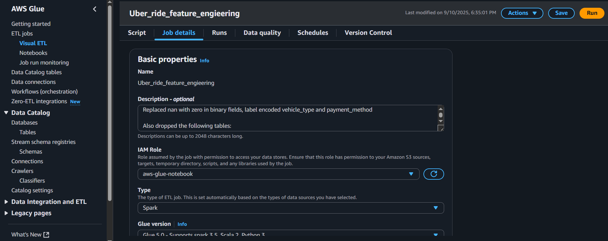
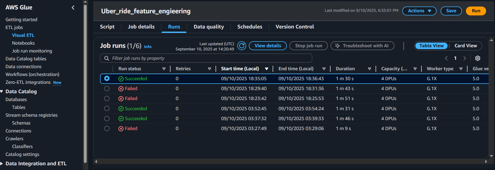
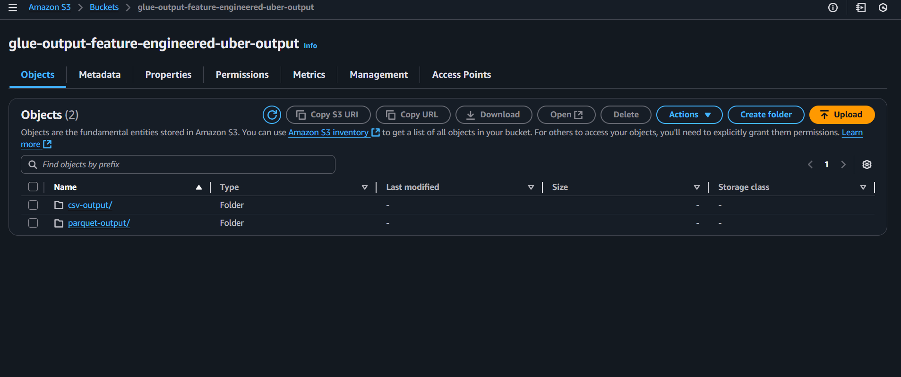

# Uber Ride Bookings Feature Engineering ETL Pipeline
## Objective
Prepare clean, structured, and feature-engineered data from raw Uber ride booking records for predictive analytics and machine learning, focusing on the target variable: **booking value (ride fare)**.

## Folder Structure & Outputs
- **pyspark_script.py**: Main ETL and feature engineering script (AWS Glue + PySpark).
- **uber_dataset_refined.csv**: Final processed CSV output (for inspection & analytics).
- **run-1757511365854-part-r-00000**: Parquet output (for ML pipelines & Athena queries).
- **Report.docx**: Detailed workflow and feature engineering report.

## Data Source
- **Raw Input**: CSV file (`ncr_ride_bookings.csv`) stored in Amazon S3.
- **Schema**: Includes ride timestamps, vehicle type, pickup/drop locations, ride metrics (VTAT, CTAT, distance), cancellation flags, ratings, and payment method.

## Workflow Architecture
1. **Ingestion (AWS Glue)**
	- Glue crawler catalogs raw S3 data.
	- Glue ETL job reads CSV into a DynamicFrame.
2. **Schema Normalization**
	- Converts date to `date`, time to `timestamp`.
	- Ride statistics and monetary values to numeric types.
	- Cancellation/incomplete flags cleaned to integers.
3. **Feature Engineering (PySpark)**
	- Target: `booking_value` (ride fare).
	- Categorical encodings:
	- `vehicle_type` → label encoding (ebike=1, sedan=2, ...).
	- `payment_method` → label encoding (UPI=1, Cash=3, Credit Card=5, missing=0).
	- Null handling: cancellation/incomplete flags set to 0 if missing.
	- Numeric features (avg_vtat, avg_ctat, ride_distance, ratings) preserved.
4. **Data Quality Checks**
	- Glue data quality rules validate schema integrity (non-empty, valid column counts).
5. **Output Storage**
	- Final dataset written to S3 as Parquet and CSV.

## Feature Engineering Decisions
### Retained Features (Predictors for `booking_value`)
- **Temporal**: `ride_date`, `ride_time` (seasonality, surge pricing)
- **Ride Characteristics**: `vehicle_type_encoded`, `ride_distance`, `avg_vtat`, `avg_ctat`
- **Ride Outcome Flags**: `cancelled_rides_by_customer`, `cancelled_rides_by_driver`, `incomplete_rides`
- **Service Quality**: `driver_ratings`, `customer_rating`
- **Payment Method**: `payment_method_encoded`

### Dropped Features
- **Pickup/drop location**: High cardinality, not used for ML without geospatial engineering.
- **Raw string versions of date/time/cancellations**: Replaced by cleaned numeric/timestamp forms.
- **CustomerID/BookingID**: Not useful for target prediction.

## Final Feature Set
| Feature                   | Type      | Role                        |
|---------------------------|-----------|-----------------------------|
| ride_date                 | date      | temporal predictor          |
| ride_time                 | timestamp | temporal predictor          |
| vehicle_type_encoded      | int       | categorical predictor       |
| avg_vtat                  | float     | numeric predictor           |
| avg_ctat                  | float     | numeric predictor           |
| cancelled_rides_by_customer | int     | target modifier             |
| cancelled_rides_by_driver | int       | target modifier             |
| incomplete_rides          | int       | target modifier             |
| ride_distance             | double    | key predictor of booking_value |
| driver_ratings            | double    | quality indicator           |
| customer_rating           | double    | quality indicator           |
| payment_method_encoded    | int       | categorical predictor       |
| booking_value             | float     | Target Variable             |

## Usage
1. **Run ETL**: Use `pyspark_script.py` in AWS Glue to process raw S3 data.
2. **Outputs**:
	- **CSV**: `uber_dataset_refined.csv` (for inspection, BI, analytics)
	- **Parquet**: `run-1757511365854-part-r-00000` (for ML, Athena)

## Conclusion
This ETL pipeline delivers a feature-engineered Uber dataset focused on predicting ride booking value (fare amount). The final dataset is:
- **Cleaned**: nulls replaced, types normalized
- **Feature-rich**: categorical encodings, temporal features, ride metrics
- **Target-ready**: centered on booking_value
- **Accessible**: stored in S3 (Parquet + CSV) for ML and BI workloads

### Suitable for:
- Fare prediction
- Revenue forecasting
- Dynamic pricing models

## Step-by-Step Approach (with Screenshot Suggestions)

Follow these steps to reproduce the ETL workflow and document your process with screenshots:

1. **AWS S3 Setup**
	- Upload the raw CSV (`ncr_ride_bookings.csv`) to your S3 bucket.
	- 

2. **Glue Crawler Configuration**
	- Create a Glue Crawler to catalog the raw data.
	- 

3. **Glue ETL Job Creation**
	- Create a Glue ETL job and attach `pyspark_script.py`.
	- Configure job parameters (input/output buckets, IAM roles).
	- 

4. **Script Execution**
	- Run the Glue ETL job.
	- Monitor job progress and logs.
	- 

5. **Output Verification**
	- Check S3 for output files: `uber_dataset_refined.csv` and Parquet file (`run-1757511365854-part-r-00000`).
	- 

6. **Data Inspection**
	- Download and inspect the output files locally or in Athena.
	- Verify the attached csv file.


View the uber task report file for more details.

## Task 2: CloudWatch Logs Transformation and Querying Workflow

### Objective
The goal of this task was to build an automated workflow to extract, clean, and transform raw CloudWatch logs into a structured format that enables easy querying and analysis in Amazon Athena.

This involved:
1. Using AWS Glue (PySpark) for ETL (Extract, Transform, Load).
2. Storing cleaned logs in S3.
3. Querying structured logs with Amazon Athena.

### Raw Input
The raw dataset was a CSV file exported from CloudWatch Logs into an S3 Bucket in this format:

```
timestamp,message
1757511342804,"INFO    2025-09-10T13:35:42,804   10153   org.apache.spark.metrics.source.StageSkewness   [Thread-10]   29   [Observability] Skewness metric using Skewness Factor = 5"
```

**Challenges:**
- The message column contained multiple attributes mixed together (timestamp, log level, class name, thread, etc.).
- The structure was not suitable for querying (e.g., filtering by ERROR, aggregating by date).

### Feature Engineering & Transformations
To make the logs queryable, regex-based parsing was applied inside an AWS Glue PySpark job (`pyspark_script_cloudwatch_logs.py`).

#### Steps Taken
1. **Regex Extraction**
	- Extracted key components from the message field:
	  - `timestamp_raw`: extracted event timestamp string.
	  - `log_level`: captured INFO, ERROR, DEBUG, etc.
	  - `thread`: extracted thread name (e.g., Thread-10).
	  - `class`: Java/Python class that logged the event.
	  - `line`: line number in source file.
	  - `message_clean`: actual log message text.
2. **Type Conversion**
	- Converted `timestamp_raw` to a `timestamp` column (timestamp type).
	- Extracted `date` (date type) from timestamp for partitioning and easy filtering.
3. **Filtering Noise**
	- Removed rows where `message_clean` was empty or null (avoided blank entries).

#### Final Schema
After transformations, the structured dataset contained the following columns:

| Column         | Type      | Description                                      |
|--------------- |---------- |-------------------------------------------------|
| timestamp      | timestamp | Event timestamp with full precision.             |
| log_level      | string    | Log level (INFO, ERROR, DEBUG, WARN, TRACE).     |
| thread         | string    | Thread name that produced the log.               |
| class          | string    | Class/package name of the log source.            |
| line           | int       | Line number in the source file.                  |
| message_clean  | string    | Cleaned human-readable log message.              |
| date           | date      | Event date (extracted from timestamp).           |

### Workflow Overview
**Extract**
- Source: CloudWatch logs exported to S3 (`log-events-viewer-result.csv`).
- Format: CSV.

**Transform (Glue Job / PySpark)**
- Parsed message using regex.
- Added structured fields (log_level, class, etc.).
- Converted timestamps into proper types.
- Removed empty rows.

**Load**
- Saved cleaned data as CSV in S3 under `s3://cloudwatch-cleaned-logs-aip-71/cleaned-logs/`.
- Ensured single file output (`part-0000*.csv`).

**Query (Athena)**
- Created Athena external table over the cleaned logs.
- Queried logs by date, log_level, and keywords.

### Why These Features Were Created
- `timestamp`: Enables time-series queries (e.g., logs per hour/day).
- `date`: Optimized partitioning in Athena, allows fast date filtering.
- `log_level`: Separates ERROR/INFO logs for reliability monitoring.
- `thread`: Useful for debugging concurrency or thread-specific issues.
- `class`: Helps trace which component of the system generated logs.
- `line`: Assists in pinpointing exact code lines for debugging.
- `message_clean`: Human-readable message for deeper insights and keyword search.

### Example Athena Queries
*Query logs for ERRORs on a specific date:*
```sql
SELECT * FROM cloudwatch_logs WHERE log_level = 'ERROR' AND date = '2025-09-10';
```

*Aggregate logs by log_level:*
```sql
SELECT log_level, COUNT(*) FROM cloudwatch_logs GROUP BY log_level;
```

*Search for a keyword in messages:*
```sql
SELECT * FROM cloudwatch_logs WHERE message_clean LIKE '%Skewness%';
```

### Conclusion
By engineering new features from the unstructured message column, we converted raw CloudWatch logs into a structured dataset suitable for analytical querying.

This workflow:
- Improves log observability.
- Enables faster debugging and monitoring via Athena.
- Provides flexibility for future extensions (e.g., partitioning by log_level or date for performance).
